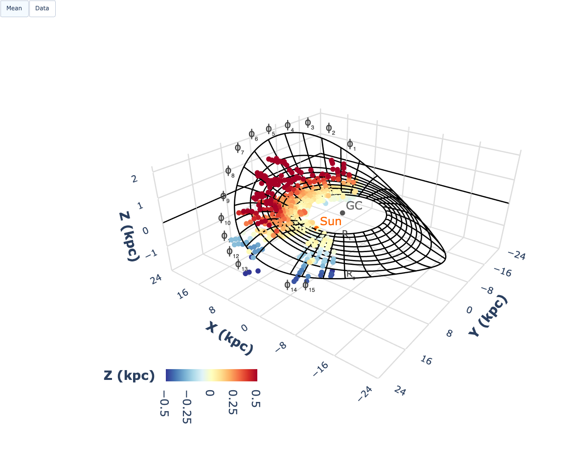
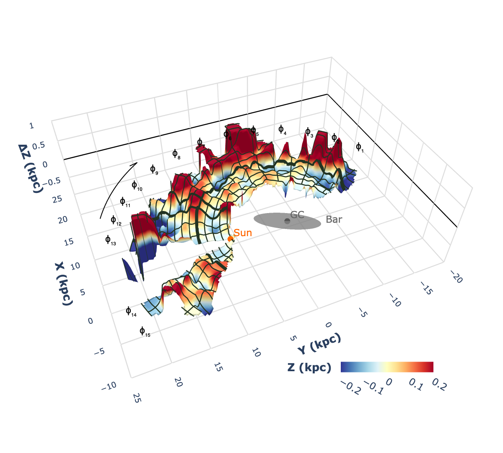
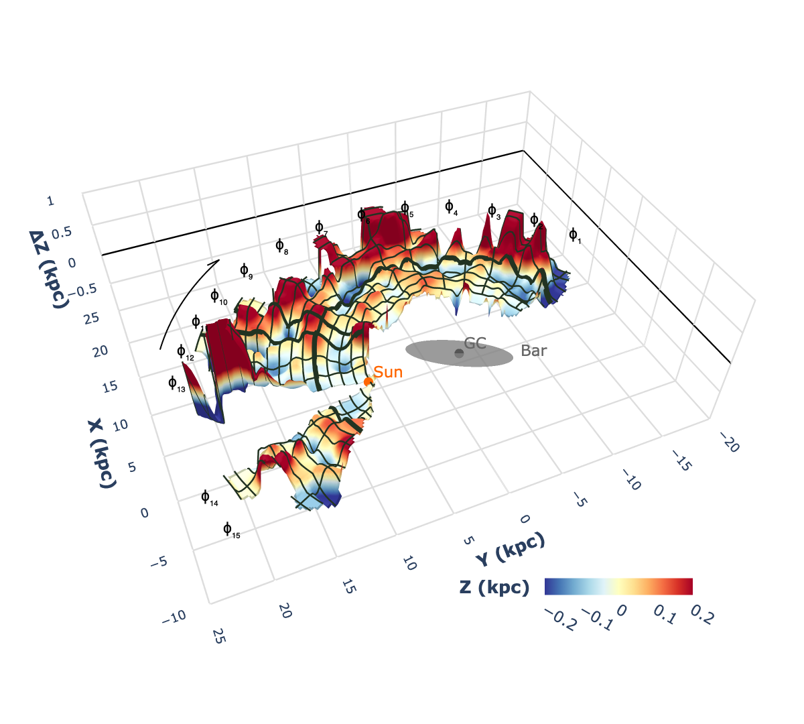
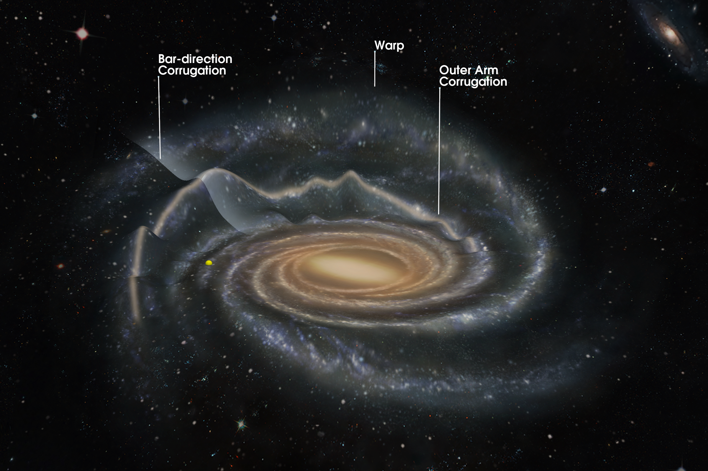

# GalaxyWarp
cf. [Paper](LINK_HERE)

Below are preview of 3D interactive figures.
Click the image to open the interactive version.

### 📌 Figure 1a: m = 1 CO warp model

---

### 📌 Extended Data Figure 1: m = 1,2 CO warp model

---

### 📌 Figure 2a: Corrugated Galactic CO disk after subtraction of the m = 1 CO warp model

---

### 📌 Extended Data Figure 2: Corrugated Galactic CO disk after subtraction of the m = 1,2 CO warp model

---

### 📌 Figure 4: A schematic three-dimensional view of the Milky Way

