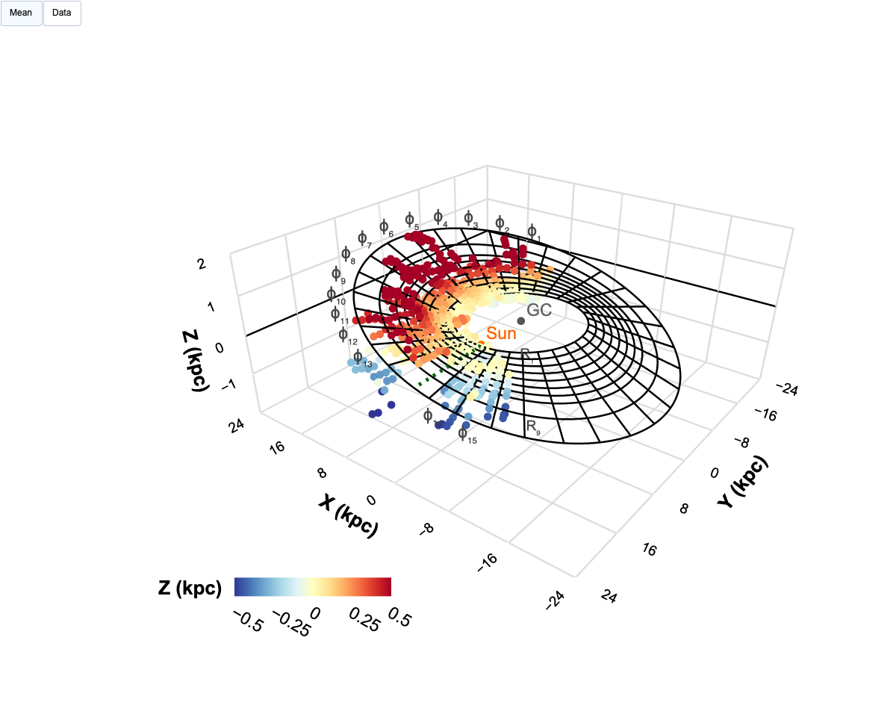
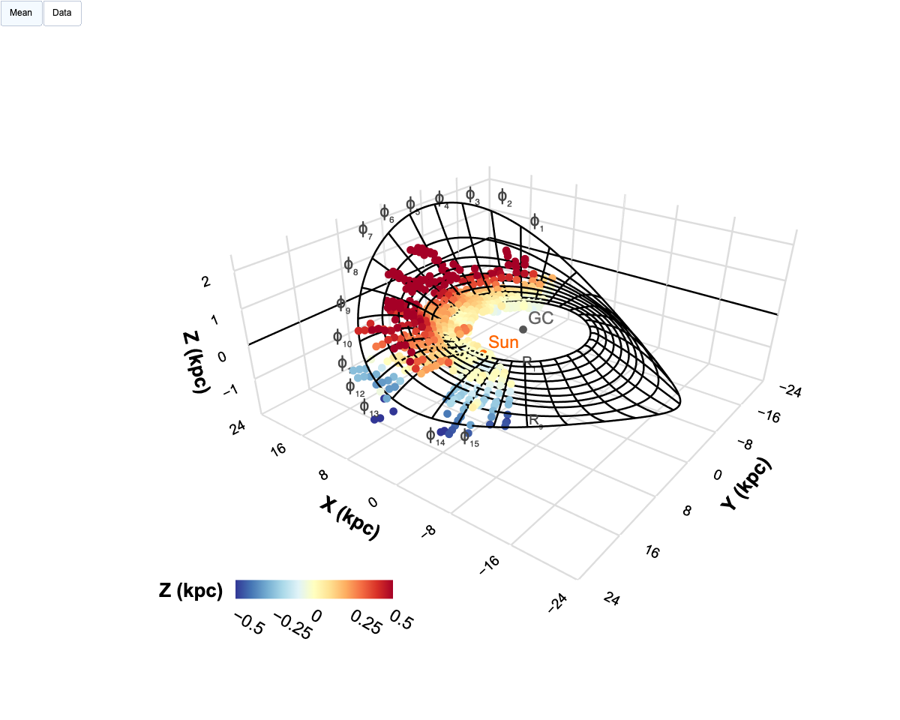
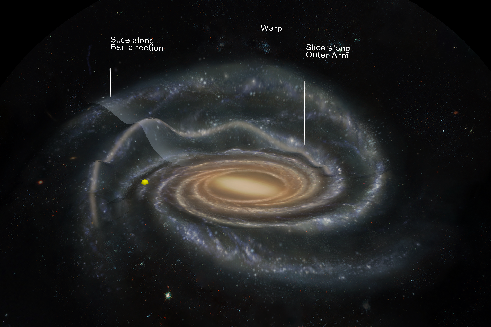

# GalaxyWarp
cf. [Paper](LINK_HERE)

# System requirements:
The code has been tested and verified to run on Python 3.8, with key dependencies:
  - **numpy** 1.23.5
  - **emcee** 3.1.2
  - **matplotlib** 3.7.5
  - **plotly** 6.2.0
  - **pyvista** 0.42.3

# Installation:
```
git clone https://github.com/shbzhang/GalaxyWarpCorrugations
```

# Data availability:
The catalog of clouds used in the paper is available at [Science Data Bank](https://www.scidb.cn) via `doi:10.57760/sciencedb.1309`

After downloading the catalog, modify `src/mcmcFittingFunction0129.py` with your settings. 
  - Modify `component` to switch between `m=1` and `m=1, 2` model.
  - Switch `warp` to fit warp models or corrugation models.
  - Switch `radwave` to fit radial or azimuthal corrugation models.
  - Modify `params` to switch a parameter between free and fixed.

Run a McMC fitting process with:
```
python src/mcmcFittingFunction0129.py
```

# Interactive figures: 
Below are preview of 3D interactive figures.
Click the image to open the interactive version.

### 📌 Supplementary Figure 1: m = 1 CO warp model.
The interactive counterpart to Figure 1a.
- Created by `src/mcmcFittingFunctionErr.py` with `component=1` and `warp=True`.

[](https://shbzhang.github.io/GalaxyWarpCorrugations/Supp_Fig1.html)

---

### 📌 Supplementary Figure 2: m = 1, 2 CO warp model.
The interactive counterpart to Extended Data Figure 1.
- Created by `src/mcmcFittingFunctionErr.py` with `component=2` and `warp=True`.

[](https://shbzhang.github.io/GalaxyWarpCorrugations/Supp_Fig2.html)

---

### 📌 Supplementary Figure 3: A schematic three-dimensional view of the Milky Way.
The interactive counterpart to Figure 4.
- Created by `src/schematic.py`.

[](https://shbzhang.github.io/GalaxyWarpCorrugations/Supp_Fig3.html)

