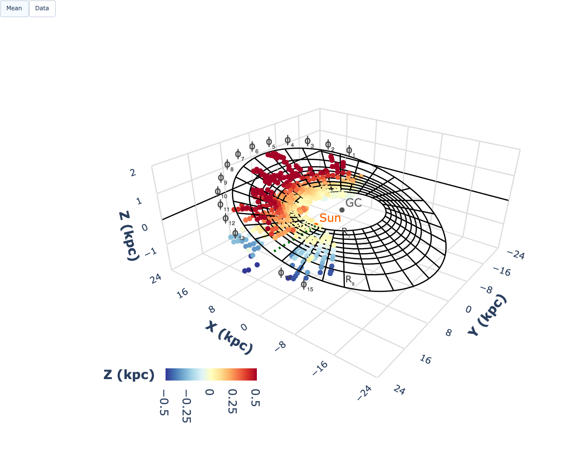
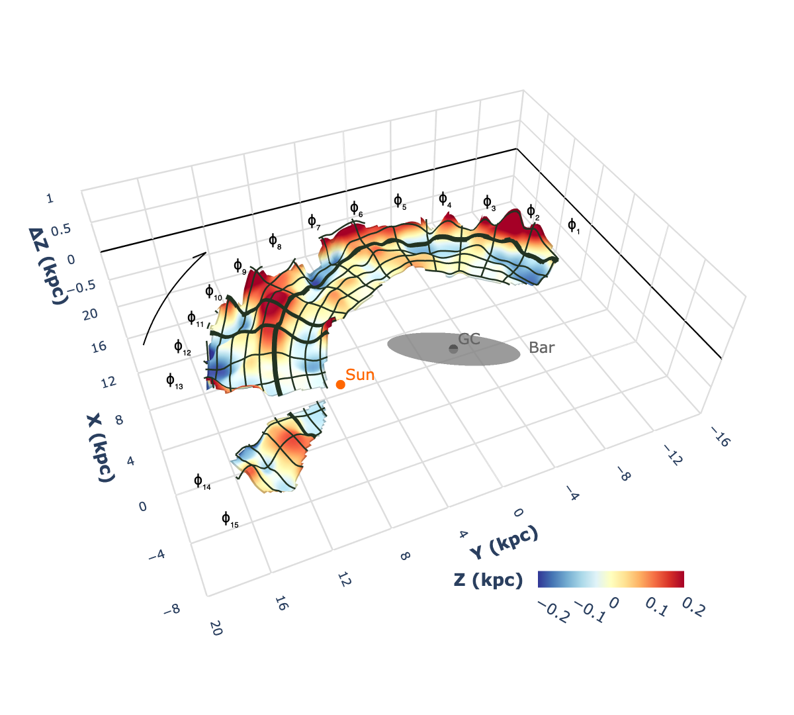
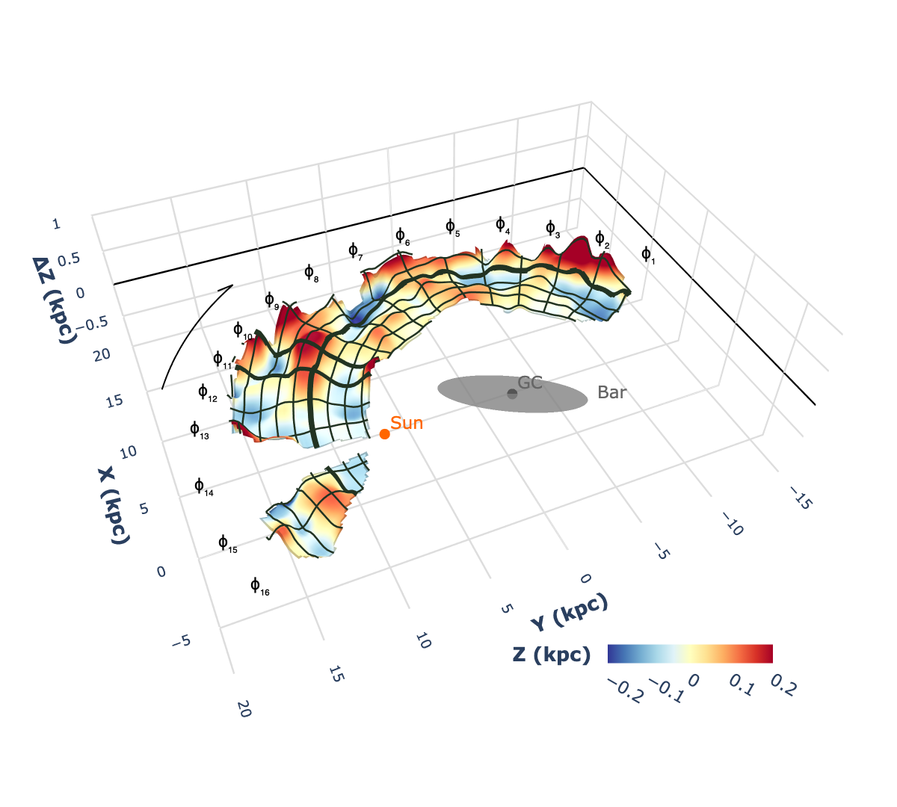
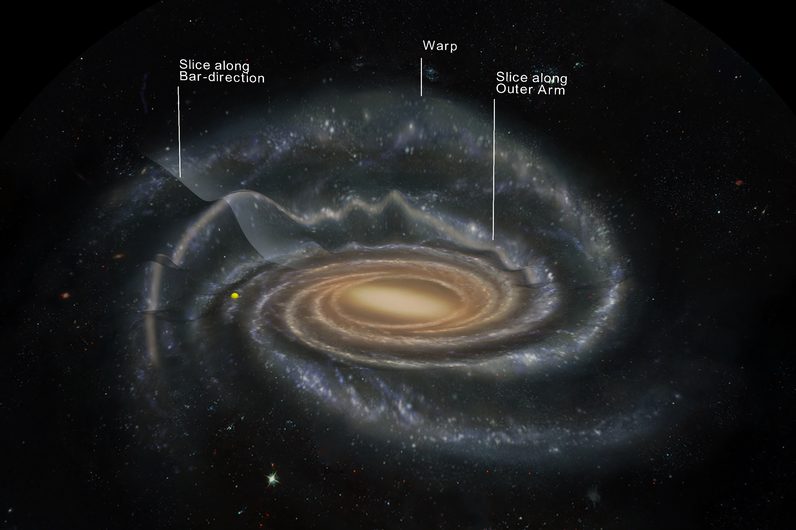

# GalaxyWarp
cf. [Paper](LINK_HERE)

# System requirements:
The code has been tested and verified to run on Python 3.8, with dependencies:
  - **numpy** 1.23.5
  - **emcee** 3.1.2
  - **matplotlib** 3.7.5
  - **plotly** 6.2.0
  - **pyvista** 0.42.3

# Installation:
```
git clone https://github.com/shbzhang/GalaxyWarpCorrugations
```

# Data availability:
The catalog of clouds used in the paper is available at [Science Data Bank](https://www.scidb.cn) via doi:10.57760/sciencedb.1309

After downloading the catalog, modify `src/mcmcFittingFunction0129.py` with your settings. 
Run a McMC fitting process with:
```
python src/mcmcFittingFunction0129.py
```

# Interactive figures: 
Below are preview of 3D interactive figures.
Click the image to open the interactive version.

### 📌 Figure 1a: m = 1 CO warp model

[](https://shbzhang.github.io/GalaxyWarpCorrugations/median_model_1comp.html)

---

### 📌 Extended Data Figure 1: m = 1,2 CO warp model

[](https://shbzhang.github.io/GalaxyWarpCorrugations/median_model_2comp.html)

---

### 📌 Figure 2a: Corrugated Galactic CO disk after subtraction of the m = 1 CO warp model

[](https://shbzhang.github.io/GalaxyWarpCorrugations/dZ_1comp.html)

---

### 📌 Extended Data Figure 2: Corrugated Galactic CO disk after subtraction of the m = 1,2 CO warp model

[](https://shbzhang.github.io/GalaxyWarpCorrugations/dZ_2comp.html)

---

### 📌 Figure 4: A schematic three-dimensional view of the Milky Way

[](https://shbzhang.github.io/GalaxyWarpCorrugations/schematic.html)

